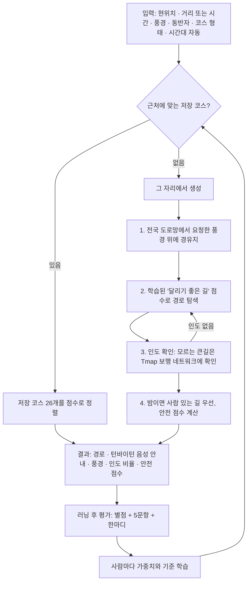

# 러닝 코스 추천 — 발표 자료 (진도 점검 · 중간 점검 대비)

> 팀 공유용입니다. 발표 슬라이드를 만들 때 여기 있는 문장·표·수치를 그대로 가져다 쓰면 됩니다.
> 수치는 전부 2026년 10월 1~4일에 실제로 잰 값입니다. 담당: 모델 개발 · 자료 수집.

**목차**

1. [한 줄 요약](#1-한-줄-요약)
2. [문제 정의](#2-문제-정의)
3. [시스템 구조](#3-시스템-구조)
4. [기능별 상세](#4-기능별-상세)
5. [AI 요소](#5-ai-요소-두-가지-학습)
6. [사용한 데이터](#6-사용한-데이터)
7. [핵심 수치](#7-핵심-수치)
8. [지난 회의 항목 대응](#8-지난-회의-항목-대응)
9. [진도 점검 5분 발표 구성과 대본](#9-진도-점검-5분-발표-구성과-대본)
10. [데모 시나리오](#10-데모-시나리오)
11. [예상 질문과 답](#11-예상-질문과-답)
12. [한계](#12-한계)
13. [중간 점검 대비](#13-중간-점검-대비)
14. [팀원별로 할 일](#14-팀원별로-할-일)
15. [용어](#15-용어)

---

## 1. 한 줄 요약

현위치·취향·시간대에 맞춰 **인도로 이어지는 러닝 코스를 그 자리에서 만들고**, 뛰고 난 평가로 **사람마다 다르게 학습**하는 러닝 코스 추천 모델과 서버.

## 2. 문제 정의

지도 앱의 보행자 경로는 **최단 거리**를 준다. 러닝 코스로는 맞지 않는다.

| 지도 앱 경로의 문제 | 러너에게 필요한 것 |
|---|---|
| 강변 산책로가 옆에 있어도 한 블록 안쪽의 빠른 길로 잇는다 | 풍경이 있는 길을 따라가는 코스 |
| 차도와 인도를 가리지 않는다 | 인도·보행로로만 이어지는 코스 |
| 신호등을 고려하지 않는다 | 덜 멈추는 코스 |
| 밤에도 인적 드문 길로 보낸다 | 밤에는 사람이 있는 밝은 길 |
| 누구에게나 같은 길을 준다 | 사람마다 다른 취향(오르막, 거리, 풍경) 반영 |

## 3. 시스템 구조



| 구성 | 기술 |
|---|---|
| 서버 | Python, FastAPI |
| 경로 탐색 | 직접 구현한 도로망 그래프 + 비용 기반 최단경로(다익스트라) |
| 지도 데이터 | OpenStreetMap 한국 전체 → 로컬 SQLite (요소 2,052,310개) |
| 인도 확인 · 장소 검색 | Tmap 보행자 경로 · POI API |
| 데모 화면 | MapLibre GL 3D 지도, 브라우저 음성 안내 |
| 저장 | SQLite (사용자·평가·후기·즐겨찾기), JSON (저장 코스) |
| 테스트 | pytest 352개 |

## 4. 기능별 상세

각 기능을 **무엇을 / 왜 / 어떻게 / 결과** 순서로 정리했다.

### 4.1 실시간 코스 생성: 도로망에서 직접 탐색

- **무엇을**: 저장된 코스가 없는 곳에서 그 자리에서 코스를 만든다. 순환(제자리로 돌아옴), 왕복(갔던 길로 돌아옴), 편도.
- **왜**: Tmap 최단 경로를 이어 붙이면 풍경을 지나가지 않고, 차도로 가고, 같은 길을 되짚는다.
- **어떻게**:
  1. 한국 전체 OSM 파일을 받아 걸을 수 있는 길과 지형(해안선·강·공원·숲 등)만 로컬 DB로 만든다.
  2. 요청한 풍경 위의 지점을 경유지로 잡는다. 바다·큰 강 건너편(다리를 찾아 멀리 돌게 됨), 막다른 길은 제외한다.
  3. 길마다 '달리기 좋은 정도'(0~1, [5장](#5-ai-요소-두-가지-학습))를 매기고, 나쁜 길은 최대 3배 길게 쳐서 탐색한다. 순환은 이미 지나간 길을 4배 길게 쳐서 되짚지 않게 한다.
  4. 턴바이턴 안내(좌·우회전, 거리)도 도로망에서 직접 만든다.
- **결과**: 여의도 강변 순환 6km는 예전 방식으로는 만들지 못했는데 지금은 6.37km. 새 동네 첫 요청 13~20초 → 3~12초.

### 4.2 인도 규칙: 인도 없는 차도는 지나가지 않는다

- **무엇을**: 차와 섞여 달리는 차도 구간이 있는 코스는 내보내지 않는다. 골목은 불가피할 때만.
- **왜**: 러닝이니까. OSM 한국 데이터에는 인도 유무가 거의 없다(전국 약 9천 개 길).
- **어떻게**: 길을 넷으로 나눈다.

  | 길 | 판단 근거 | 취급 |
  |---|---|---|
  | 차 없는 길 | OSM 보행로·자전거길 | 그대로 |
  | 인도 있는 차도 | OSM 인도 표시 또는 Tmap 확인 | 그대로 |
  | 골목·이면도로 | OSM 주택가 길·생활도로 | 2~4배 길게 쳐서 불가피할 때만 |
  | 인도를 모르거나 없는 큰길 | — | 지나가지 않음 |

  경로에 인도를 모르는 큰길이 있으면 그 경로를 Tmap 보행 네트워크에 넘겨 구간별 종류(인도 분리 21 / 차 없는 보행로 23 / 인도 분리 없음 22)를 받는다. 인도가 없으면 도로망에서 빼고 다시 짠다(최대 4번). 확인 결과는 길마다 쌓여서 다음부터는 묻지 않는다(지금 626개 길).
- **결과**: 잰 9개 요청(광주·여수·대전·해운대·여의도·망원동) 모두 **차도 0%**, 골목 최대 8%. 요청당 Tmap 호출 0~3회.

### 4.3 풍경: 측정해서 붙이고, 쉽게 고르게

- **측정**: 경로를 25m 간격으로 찍고, 그중 몇 %가 해안선 200m 안, 강 80m 안, 공원 안… 인지 잰다. 기준을 넘을 때만 태그를 붙인다. 16종.
- **선택지**: 16종은 고르기 어렵다(보행자길·자전거길·차없는길의 차이 등). 화면에는 4묶음 10가지만 보여준다.

  | 묶음 | 선택지 | 보여주는 설명 |
  |---|---|---|
  | 물가 | 바다 · 강·하천 · 호수 | "바다를 보면서 달려요" 등 |
  | 자연 | 공원 · 숲 | |
  | 길 | 차 없는 길 · 캠퍼스·운동장 | |
  | 볼거리 | 도심 · 명소·전망 · 다리 건너기 | |

- **현위치 기준**: 반경 10km 안에 실제로 있는 풍경만, "걸어서 4분"처럼 거리와 함께 가까운 순으로 보여준다. 내륙에서는 '바다'가 나오지 않는다.
- **결과**: 광주 강변 순환 5km의 강변 비율 14~22%(태그 안 붙음) → 67%. 여수 바다뷰 4km 거리 2.18/6.86km → 4.12~4.24km.

### 4.4 안전: 밤 경로와 안전 점수

- **밤 경로**: 밤(21~05시, 요청에 직접 지정 가능)에는 상점이 60m 안에 있거나 인도 있는 큰길을 우선하고, 상점도 조명 표시도 없는 공원·숲·물가 산책로는 2.5배 길게 친다. 경유지도 인적 드문 곳은 피하고, 인적 드문 구간이 가장 적은 후보만 남긴다.

  | 순환 요청 | 낮: 인적 드문 길 | 밤: 인적 드문 길 |
  |---|---|---|
  | 광주 상무 5km | 37% | 0% |
  | 해운대 5km | 28% | 2% |
  | 망원동 4km | 31% | 7% |
  | 여의도 6km | 31% | 22% |

- **안전 점수**: CCTV 밀도(40%) + 편의점 밀도(35%, 밤 유동인구의 대리 지표) + 지구대·파출소까지 거리(25%). 예전에는 실시간 코스가 0.7 고정이었는데 지금은 그 자리의 시설로 계산한다(예: 광주 낮 경로 0.37, 밤 경로 0.47).

### 4.5 목적지 지정

- 장소 이름을 치면 Tmap 장소 검색으로 후보 목록을 보여주고 고르게 한다. 현위치 주변을 우선하고, 건물·섬 한가운데가 아니라 걸어서 들어가는 입구 좌표를 쓴다.
- 예전 검색은 "스타벅스"를 오키나와 좌표로 줬다. 지금은 스타벅스 광주상무점(0.8km).
- 8km 이내 목적지는 위의 인도·밤 규칙으로 경로를 짠다.

### 4.6 러닝 후 평가와 취향 화면

- 별점 + 5문항(거리·오르막·멈춤·풍경·안심, 각 3지선다) + 한마디.
- '내 취향' 화면: 취향 요약 문장, 항목별 중요도, 맞춰진 기준, 지금까지 한 답, 평가 이력, 즐겨찾기.

### 4.7 사용자 데이터 · 로그인

- 사용자별 DB: 학습된 취향, 평가 이력(평가할 때마다의 가중치 포함), 후기, 즐겨찾기.
- 로그인: 비밀번호는 scrypt 해시만, 로그인 토큰도 해시만 저장. 계정의 데이터는 본인만 조회·삭제. 로그인 없이 쓰다가 가입하면 그동안의 취향이 계정으로 옮겨진다. 탈퇴하면 전부 삭제.

### 4.8 데모 앱(웹)

- 3D 지도, 진행 방향으로 지도 회전, 턴바이턴 음성 안내, 왕복 복귀 구간 안내.
- 실제 GPS 모드와 시뮬레이션 모드, 내 현재 위치 사용, 즐겨찾기 ☆.

## 5. AI 요소: 두 가지 학습

### 5.1 길 점수 모델 (모든 사용자 공통, 지도학습)

- **문제**: 어떤 길이 '달리기 좋은 길'인가.
- **정답 데이터**: 사람들이 OSM에 달리기·걷기·자전거 코스로 등록한 길(정답)과 같은 동네의 나머지 길(오답). 자전거 코스의 차도 구간과 등산로는 애매해서 뺐다.
- **특징 23개**: 길 종류(13), 물가·해안·호수·공원·숲 인접(5), 다리, 터널, 조명 표시, 이름 있음, 인도 표시.
- **모델**: 로지스틱 회귀. 격자 2,496칸, 학습 35,324개 · 검증 8,216개 길(정답 8,580개).
- **성능**: 검증 AUC **0.971** (손으로 정한 가중치 0.924).

  | 특징 | 가중치 | 해석 |
  |---|---|---|
  | 자전거길 | +5.88 | 한강·탄천 자전거길처럼 러너가 몰리는 길 |
  | 인도 표시 | +2.53 | |
  | 보행로 | +2.46 | |
  | 이름 있는 길 | +2.24 | 산책로·둘레길 이름 |
  | 조명 표시 | +1.40 | |
  | 해안 인접 | +0.93 | |
  | 주택가 길 | −2.30 | |
  | 2차 도로 | −2.70 | |
  | 생활도로 | −3.97 | |
  | 간선도로 | −5.56 | |

  계단(+1.59)은 걷기 코스가 섞인 영향이라, 경로 탐색에서 계단은 따로 3배 불리하게 친다.

- **GNN과의 관계**: 회의에서 나온 "다음 노드를 결정하는 GNN"은 정답 데이터가 부족해(달리기 코스로 등록된 길은 전국 100개 남짓) 이번에는 '학습된 길 점수 + 직접 탐색'으로 만들었다. 점수 모델만 바꾸면 되도록 나눠 놓아서, 앱의 실주행 평가가 쌓이면 GNN 점수 모델로 교체할 수 있다.

### 5.2 개인 취향 학습 (사람마다, 온라인 학습)

- **별점**: 같이 추천됐던 다른 코스보다 무엇이 강했는지로 가중치를 고친다.
  `w_k ← w_k · exp(η · r · (s_k − s̄_k))`, `r = (평점−3)/2`, `s̄_k` = 다른 추천 코스들의 평균. 평가가 쌓일수록 학습률 η가 줄어든다. 각 가중치는 0.03~0.45 안.
- **5문항**: 답은 그 항목에 대한 직접 증거라 그 항목만 고친다. 불만(+1)은 "중요하다"는 강한 증거, 칭찬(+0.5)은 약한 증거, "보통"(−0.25)은 신경 쓰지 않는다는 증거.
- **기준 이동**: "힘들었어요/평탄했어요"는 오르막 목표를 ±15%, "길었어요/짧았어요"는 시간으로 고른 거리 환산을 ±7% 옮긴다.
- **설명**: "신호등에 자주 멈추는 걸 불편해하세요 (2번 말씀하셨어요)"처럼 실제로 답한 내용에 근거가 있는 문장만 보여준다.
- **검증(테스트)**: 기본 가중치로 2위였던 코스가 평가 3번 만에 1위. 오르막 "보통"을 고른 사람이 "힘들었어요"를 3번 답하면 다음 추천 1위가 평탄한 코스로 바뀐다.

## 6. 사용한 데이터

| 데이터 | 출처 | 용도 |
|---|---|---|
| 도로·지형·시설 | OpenStreetMap 한국 전체 (Geofabrik, 2026-09-29, 약 290MB) | 경로 탐색, 풍경 측정, 안전 시설, 길 점수 학습 |
| 공개 러닝·걷기·자전거 코스 | OSM route 관계 | 길 점수 모델의 정답 |
| 인도 여부 | Tmap 보행자 경로 API (구간별 roadType) | 인도 확인 |
| 장소 검색 | Tmap POI API | 목적지 |
| 고도 | Open Topo Data | 오르막 |
| 날씨 | 기상청 단기예보 | 날씨 점수 |
| 저장 코스 | 여수 14 · 광주 12 실제 코스 | 저장 코스 추천 |

## 7. 핵심 수치

| 항목 | 전 | 후 |
|---|---|---|
| 광주 강변 순환 5km, 강변 비율 | 14~22% (태그 안 붙음) | **67%** · 4.43km |
| 여의도 강변 순환 6km | 만들지 못함 | **6.37km** · 차도 0% |
| 여수 바다뷰 순환 4km, 거리 | 2.18km / 6.86km | **4.12~4.24km** |
| 인도 없는 차도 구간 (9개 요청) | 확인 불가 | **모두 0%** · 골목 최대 8% |
| 밤 인적 드문 길 (광주 상무 순환) | 37% | **0%** |
| 새 동네 첫 순환 요청 시간 | 13~20초 | **3~12초** |
| 요청당 Tmap 호출 | 3~8회 | **0~3회** |
| 실시간 코스 안전 점수 | 0.7 고정 | 실제 계산 |
| 목적지 "스타벅스" (광주 상무) | 오키나와 좌표 | 광주상무점 0.8km |
| 길 점수 모델 AUC | 0.924 | **0.971** |
| 원하는 코스가 1위가 되기까지 | — | 평가 3번 |
| 테스트 | — | 352개 통과 |

## 8. 지난 회의 항목 대응

회의 10개 중 **해결 5 · 부분 3 · 미착수 2**, 회의 뒤 추가된 2개(무조건 인도, 로그인)는 해결.

| 회의에서 나온 것 | 상태 | 한 것 |
|---|---|---|
| 실시간 생성이 Tmap 최단 거리를 가져온다 | ✅ 해결 | 전국 도로망에서 직접 탐색 |
| 노드를 어떻게 선정할 것인지 | ✅ 해결 | 풍경 위 경유지, 물 건너편·막다른 길·밤의 인적 드문 곳 제외 |
| 사용자 피드백 DB | ✅ 해결 | 별점 + 5문항 + 후기, 평가 이력 |
| 현위치에서 쓸 수 있는 풍경만 (10km) | ✅ 해결 | 실제로 있는 것만, 거리 표시, 쉬운 10종 |
| 즐겨찾기 | ✅ 해결 | API + 데모 화면 |
| 기존 러닝 코스 학습 | 🟡 부분 | OSM 공개 코스로 학습. 달리기 코스 데이터 적음 |
| GNN으로 다음 노드 결정 | 🟡 부분 | 학습된 길 점수 + 직접 탐색. GNN 교체 가능 구조 |
| 안전성 (큰길, 가로등) | 🟡 부분 | 밤 경로, 안전 점수. 가로등 데이터 없음 |
| 로드뷰처럼 보여주기 | ⬜ 미착수 | |
| 미션 · 수준별 랭크전 | ⬜ 미착수 | 담당 미정 |
| (추가) 무조건 인도로 | ✅ 해결 | 인도 없는 차도 0%, 골목은 불가피할 때만 |
| (추가) 개인별 확인 · 로그인 | ✅ 해결 | 본인만 자기 취향 조회 |

## 9. 진도 점검 5분 발표 구성과 대본

슬라이드 7장. 데모는 생성에 3~12초가 걸리고 Tmap 한도를 타므로 **미리 녹화한 영상**을 권한다.

| 시간 | 슬라이드 | 화면 | 대본 |
|---|---|---|---|
| 0:00–0:30 | 문제 | Tmap 경로와 우리 경로를 겹친 지도 | "지도 앱은 빨리 가는 길을 줍니다. 러너에게 필요한 건 차를 피하고, 풍경이 있고, 밤에도 안심되는 길입니다." |
| 0:30–1:20 | 구조 | 3장 흐름도 | "저장 코스 추천과 실시간 생성 두 갈래입니다. 생성은 전국 도로망에서 직접 길을 찾고, 인도인지 Tmap으로 확인하고, 뛰고 난 평가로 사람마다 학습합니다." |
| 1:20–2:10 | 회의 이후 | 8장 표 | "지난 회의 10개 항목 중 5개 해결, 3개 부분 해결, 2개는 담당이 정해지지 않아 미착수입니다. 추가로 나온 '무조건 인도'와 '로그인'도 해결했습니다." |
| 2:10–3:00 | 수치 | 7장 표에서 4줄 | "강변 비율이 14~22%에서 67%로, 인도 없는 차도는 측정한 9개 코스 모두 0%, 밤에는 인적 드문 길이 37%에서 0%로 줄었습니다. 길 점수 모델의 검증 AUC는 0.971입니다." |
| 3:00–4:00 | 데모 | 녹화 영상 | 10장 순서대로 |
| 4:00–4:30 | 한계 | 12장 3줄 | "가로등 데이터가 없고, 달리기 코스 학습 데이터가 적고, 밤·풍경 코스는 거리가 10~30% 어긋납니다." |
| 4:30–5:00 | 다음 | 13장 일정 | "다음 발표까지 Tmap 대비 정량 평가, 팀원 실주행으로 개인화 검증, 앱 연동을 하겠습니다." |

## 10. 데모 시나리오

1. 현위치 **광주 상무지구** → 풍경 선택지가 근처 것만 "강·하천 걸어서 4분"처럼 뜨는 것을 보여준다.
2. **강·하천 · 순환 · 5km** → 추천받기. 코스 카드에 "실시간 생성 · 강·하천 · 공원"과 "인도 ○% · 차 없는 길 ○% · 차도 0%".
3. **시뮬레이션으로 미리보기** → 3D 지도 회전, 턴바이턴 음성.
4. 도착 후 **별점 + "자주 멈췄어요"** → '내 취향' 요약 문장이 바뀐다.
5. (시간이 남으면) 로그인 → 평가 이력, 즐겨찾기 ☆.

녹화 준비: `python -m src.setup_local`로 기준 환경을 맞추고, TMAP_APP_KEY를 넣고, `python -m uvicorn src.api.main:app` 후 http://localhost:8000. 밤 경로를 보여주려면 요청에 `time_of_day: "night"`를 넣거나 밤에 녹화한다.

## 11. 예상 질문과 답

**Q. AI는 어디에 쓰였나요?**
두 군데입니다. 모든 사용자 공통의 길 점수 모델(공개 코스로 학습한 지도학습, 검증 AUC 0.971)과, 사람마다 평가로 가중치와 기준을 고치는 온라인 학습입니다.

**Q. GNN은 왜 안 썼나요?**
정답 데이터가 부족했습니다(달리기 코스로 등록된 길이 전국 100개 남짓). 점수 모델만 교체하면 되는 구조로 만들어 두었고, 앱의 실주행 평가가 쌓이면 그 데이터로 GNN을 학습할 계획입니다.

**Q. 정말 인도로만 가나요?**
인도 없는 차도는 한 구간도 지나지 않게 했고, 측정한 9개 요청 모두 0%였습니다. 주택가에서는 큰길까지 나가는 길이 골목뿐인 경우가 있어 골목은 불가피할 때만 지나고 비율을 표시합니다(최대 8%).

**Q. 데이터는 어디서 오나요?**
도로·지형은 OpenStreetMap 한국 전체, 인도 확인과 장소 검색은 Tmap, 고도는 Open Topo Data, 날씨는 기상청입니다.

**Q. Tmap 무료 한도(하루 1,000건)는 괜찮나요?**
경로를 고르는 데는 쓰지 않고 인도 확인에만 씁니다. 요청당 0~3회이고, 한 번 확인한 길은 다시 묻지 않아 쓸수록 줄어듭니다.

**Q. 안전은 어떻게 판단하나요?**
CCTV·편의점·파출소로 안전 점수를 계산하고, 밤에는 사람 있는 길을 우선합니다. 가로등 데이터는 없어서 실제 밝기는 모릅니다.

**Q. 개인정보는요?**
비밀번호와 토큰은 해시로만 저장하고, 계정 데이터는 본인만 접근합니다. 탈퇴 시 전부 삭제됩니다. 실제 서비스에는 HTTPS가 필요합니다.

**Q. 왜 팀원마다 결과가 다를 수 있나요?**
같은 지도 파일(날짜 고정)·같은 코드·같은 인도 확인 기록에서 시작하도록 설치 스크립트를 만들어서, 같은 요청에는 같은 코스가 나옵니다.

## 12. 한계

- **가로등·CCTV 데이터**: 가로등은 OSM에 전국 약 8천 개 길뿐이라 쓰지 못했다. CCTV는 지역 편차가 크다(광주 상무 주변 111개, 여의도 3개). 지자체 공공데이터가 필요하다.
- **학습 데이터 편향**: 공개 코스가 자전거길 위주라 길 점수가 자전거길에 치우쳐 있다.
- **거리 오차**: 풍경을 따라가는 순환과 밤 코스는 목표와 10~30% 어긋날 수 있다(여의도 밤 6km 요청에 4.09km).
- **설치 부담**: 직접 경로 탐색은 로컬 지형 DB(내려받기 290MB, 변환 약 8분, 880MB)가 있어야 한다. 없으면 예전처럼 Tmap 최단 경로로 동작한다.
- **저장 코스 26개**는 인도 확인을 거치지 않았다. 큰길을 건너는 지점에 횡단보도가 있는지도 확인하지 않는다.

## 13. 중간 점검 대비

진도 점검은 "무엇을 만들었고 다음에 무엇을 하나"면 충분하다. 중간 점검은 **"얼마나 잘 되는지를 숫자로 보이고, 남은 기간에 무엇을 끝낼지"**를 물을 가능성이 높다. 지금 수치는 몇 개 사례라서 아래를 준비한다.

| 준비할 것 | 내용 | 담당 |
|---|---|---|
| 정량 평가 표 | 출발점 10곳 × 거리 3종(3·5·8km) × 낮·밤을 Tmap 최단 경로 방식과 우리 방식으로 만들어 비교: 풍경 비율, 차도·골목 비율, 밤 인적 드문 길, 목표 거리 오차, 생성 시간, 실패율 | 모델·자료 |
| 실주행 사용자 평가 | 팀원 5명이 2주간 실제로 뛰고 별점·5문항 입력 → 평가 전후 추천 순위·만족도 변화 | 팀 전체 |
| 모델 설명 자료 | 5장의 가중치 표·그래프, 학습 데이터 구성, AUC | 모델·자료 |
| 앱 연동 | 앱 화면에서 추천·안내·평가·로그인이 실제로 도는 모습 | 앱 담당 |
| 리스크와 대응 | 데이터 편향, Tmap 한도, 가로등 데이터, 서버 배포와 HTTPS | 팀 전체 |

**일정안**

1. **1주차**: 전원 기준 환경 맞추기(`python -m src.setup_local`), 정량 평가 스크립트 정리와 1차 측정, 거리 오차 개선.
2. **2주차**: 실주행 평가 시작, 공공데이터(가로등·CCTV) 신청·반영, 저장 코스 26개 인도 확인.
3. **3주차**: 쌓인 평가로 길 점수 재학습(GNN 검토), 정량 평가 2차 측정, 발표 자료.

## 14. 팀원별로 할 일

**전원**

```bash
git pull
python -m src.setup_local
```

끝에 `✔ 기준 환경과 같습니다`가 나오면 된다. API 키(TMAP_APP_KEY, KMA_API_KEY)는 팀 채널에서 받아 `.env`에 넣는다.

**앱 담당: 바뀐 API**

| 바뀐 것 | 내용 |
|---|---|
| 풍경 선택지 | `GET /onboarding/scenery?lat=&lng=` 응답이 `value`·`label`·`group`·`hint`·`near`·`distance_km`. `value`를 `/recommend`의 `environment_tags`에 넣는다 |
| 코스 결과 | `scenery_labels`, `road_mix`(인도·골목 비율), `sidewalk_only`, `no_car_lanes`, `lively_ratio`·`secluded_ratio`, `safety_score`, `access_m` |
| 평가 | `GET /onboarding/feedback`(5문항), `POST /feedback`에 `aspects`·`comment` |
| 내 취향 | `GET /users/{user_id}/taste`, `DELETE /users/{user_id}` |
| 로그인 | `POST /auth/signup`·`/auth/login` → `token`을 `Authorization: Bearer` 헤더로 |
| 즐겨찾기·후기 | `/favorites`, `/reviews`, `/courses/{id}/reviews` (후기의 `user_id`는 `author`로 바뀜) |
| 목적지 | `GET /places?q=&lat=&lng=` 후보 → 고른 좌표를 `destination_lat/lng`로 |
| 환경 확인 | `GET /health`의 `local_map.matches_team` |

자세한 형식은 README와 http://localhost:8000/docs.

## 15. 용어

| 용어 | 뜻 |
|---|---|
| OSM | OpenStreetMap. 누구나 편집하는 공개 지도 데이터 |
| 도로망 그래프 | 길의 교차점을 점, 길을 선으로 놓은 구조. 경로 탐색에 쓴다 |
| roadType 21 / 22 / 23 | Tmap 보행 경로의 구간 종류: 인도 분리 / 인도 분리 없음 / 차 없는 보행로 |
| AUC | 정답 길이 오답 길보다 높은 점수를 받을 확률. 0.5는 찍기, 1.0은 완벽 |
| 지수 경사 갱신 | 가중치에 exp(학습률 × 보상 × 차이)를 곱해 고치는 방식. 가중치가 음수가 되지 않는다 |
| 인적 드문 길 | 상점도 조명 표시도 없는 공원·숲·물가 보행로 (밤 경로에서 피함) |
